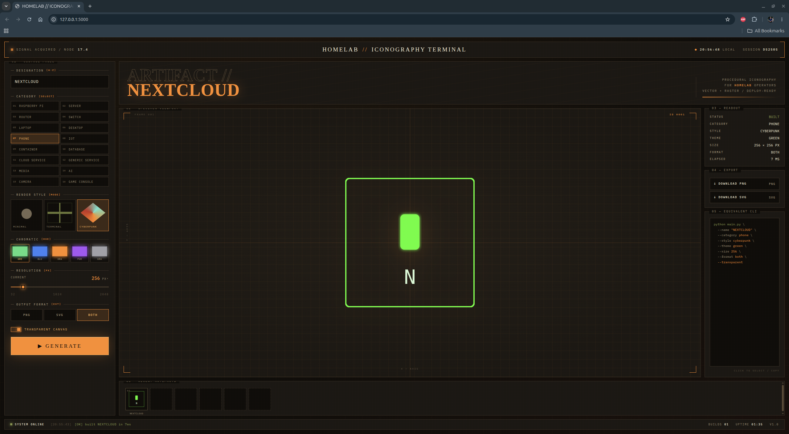

# Homelab Icon Generator

Generate clean, consistent icons for homelab devices and services using Python.

## Overview

Homelab Icon Generator is a Python CLI tool for creating simple, visually consistent icons for devices and services commonly found in self-hosted environments.

Icons are generated programmatically using geometric shapes and text — no external icon packs required. Output is available in PNG (raster), SVG (vector), and ICO formats, suitable for dashboards, network monitors, and internal apps.

## Features

- 24 device/service categories (server, router, Raspberry Pi, container, database, and more)
- 3 visual styles: minimal, terminal, cyberpunk
- 5 color themes: green, blue, orange, purple, grayscale
- PNG, SVG, and ICO export (ICO is limited to sizes up to 256px)
- Automatic initials from name (e.g. "Raspberry Pi Server" → RPS)
- Optional transparent background
- CLI and JSON batch mode

## Installation

```bash
git clone https://github.com/jimjamscott22/Homelab-Icon-Generator.git
cd Homelab-Icon-Generator
uv sync
```

> Alternatively, install with pip: `pip install -e .`

## Usage

### Single icon

```bash
uv run main.py \
  --name "Raspberry Pi Server" \
  --category raspberry_pi \
  --style terminal \
  --theme green \
  --size 256 \
  --format svg
```

### All CLI flags

| Flag | Default | Description |
|------|---------|-------------|
| `--name` | required | Device or service name |
| `--category` | required | See valid categories below |
| `--style` | `minimal` | `minimal` / `terminal` / `cyberpunk` |
| `--theme` | `blue` | `green` / `blue` / `orange` / `purple` / `grayscale` |
| `--size` | `256` | Icon size in pixels (32–2048) |
| `--format` | `both` | `png` / `svg` / `ico` / `both` / `all` |
| `--output-dir` | `output` | Directory to save files into |
| `--transparent` | off | Enable transparent background |
| `--batch` | — | Path to a JSON batch file |

### Valid categories

```
raspberry_pi  server       router        switch
laptop        desktop      phone         iot
container     database     cloud_service generic_service
media         ai           camera        game_console
cli           code         git_branch    api
firewall      vpn          nas           power
```

### Batch generation

Create a JSON array of icon configs:

```json
[
  {
    "name": "Nextcloud",
    "category": "cloud_service",
    "style": "minimal",
    "theme": "blue",
    "size": 256,
    "format": "both"
  },
  {
    "name": "Home Router",
    "category": "router",
    "style": "terminal",
    "theme": "green"
  }
]
```

Run with:

```bash
uv run main.py --batch examples/sample_icons.json
```

Each entry uses the same keys as the CLI flags. All fields except `name` and `category` are optional and fall back to defaults.

## Web UI

Start the local web server:

```bash
uv run python server.py
```

Then open http://127.0.0.1:5000 in your browser.



What the UI does: it lets you pick a category, style, theme, size, and format, then generates icons on demand and shows the resulting files for download.

Generated files are served from `/output/<path>` and written to the local `output/` directory.

On disk, files are written under `output/{format}/{category}/` with slugified filenames.

Other storage options:

- Change `OUTPUT_DIR` in `server.py` to point at a different location.
- Replace `output/` with a symlink to a folder on another disk or a synced directory.

Optional environment variables:

- `PORT` to change the port (default `5000`)
- `FLASK_DEBUG=1` to enable debug mode

## Project structure

```
homelab-icon-generator/
├── app/
│   ├── generator/
│   │   ├── colors.py       # Color palettes per theme
│   │   ├── layouts.py      # Symbol/text positioning
│   │   ├── renderer.py     # PNG and SVG rendering pipeline
│   │   ├── shapes.py       # Pillow drawing helpers
│   │   ├── symbols.py      # Procedural symbols per category
│   │   └── text_utils.py   # Initials rendering
│   ├── models/
│   │   └── icon_request.py # IconRequest dataclass
│   ├── styles/
│   │   ├── base.py         # StyleDefinition dataclass
│   │   ├── minimal.py
│   │   ├── terminal.py
│   │   └── cyberpunk.py
│   ├── utils/
│   │   ├── naming.py       # Initials generation
│   │   └── validation.py   # Input validation
│   ├── web/
│   │   └── static/         # Web UI assets (HTML/CSS/JS)
│   └── main.py             # CLI entry point
├── examples/
│   └── sample_icons.json
├── output/                 # Generated icons land here
├── server.py               # Flask web UI
├── pyproject.toml          # Dependencies and packaging
└── main.py                 # Root entry point (delegates to app/main.py)
```

## Extending the project

### Add a new category

1. Add the category name to `VALID_CATEGORIES` in `app/utils/validation.py`
2. Add a `draw_<category>(draw, cx, cy, size, color)` function in `app/generator/symbols.py`
3. Add a matching `_svg_<category>(cx, cy, size, color)` function in `app/generator/renderer.py`
4. Register both in their respective dispatcher dicts

### Add a new style

1. Create `app/styles/<name>.py` with a `get_style(palette: ColorPalette) -> StyleDefinition` function
2. Add the name to `VALID_STYLES` in `app/utils/validation.py`

### Add a new theme

1. Add a `ColorPalette` entry to `COLOR_THEMES` in `app/generator/colors.py`
2. Add the name to `VALID_THEMES` in `app/utils/validation.py`

## Roadmap

See [docs/PROJECT_REVIEW.md](docs/PROJECT_REVIEW.md) for the review findings and
the ranked list of planned features, including what has already been completed
and what remains.

## Tech stack

- Python 3.10+
- [Pillow](https://pillow.readthedocs.io/) — PNG generation
- SVG output is built as native XML (no external SVG library required)

## License

MIT
